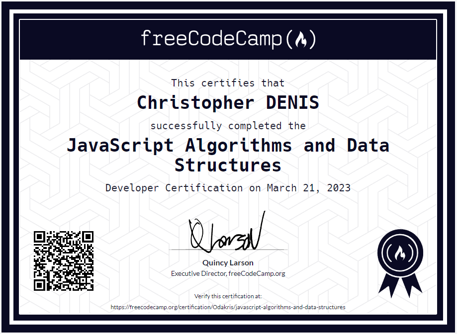

# FCC - JavaScript Algotihms and Data Structures

**[freeCodeCamp](https://www.freecodecamp.org/learn/javascript-algorithms-and-data-structures/)** JavaScript Algorithms and Data Structures projects

## Content

⚪ **[Palindrome Checker](https://github.com/odakris/FCC-JavaScript_Algotihms_Data_Structures/blob/main/01-palindrome_checker.js)**

⚪ **[Roman Numeral Converter](https://github.com/odakris/FCC-JavaScript_Algotihms_Data_Structures/blob/main/02-roman_numeral_converter.js)**

⚪ **[Ceasars Cipher](https://github.com/odakris/FCC-JavaScript_Algotihms_Data_Structures/blob/main/03-ceasars_cipher.js)**

⚪ **[Telephone Number Validator](https://github.com/odakris/FCC-JavaScript_Algotihms_Data_Structures/blob/main/04-telephone_number_validator.js)**

⚪ **[Cash Register](https://github.com/odakris/FCC-JavaScript_Algotihms_Data_Structures/blob/main/05-cash_register.js)**

## Certificate of Completion 🏆

  

